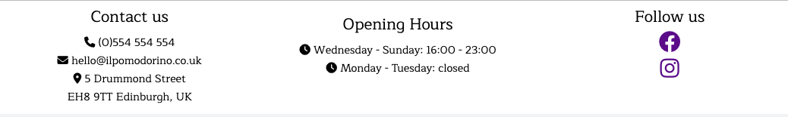
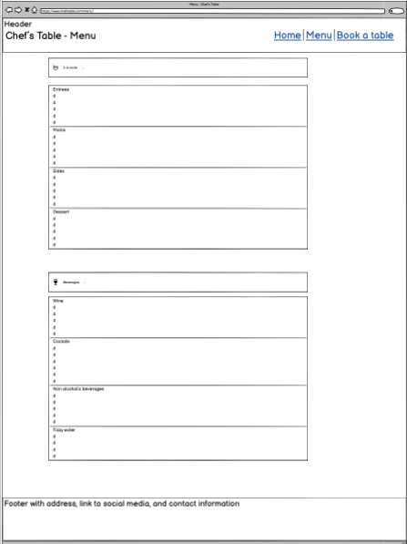
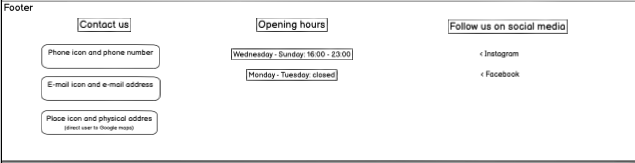
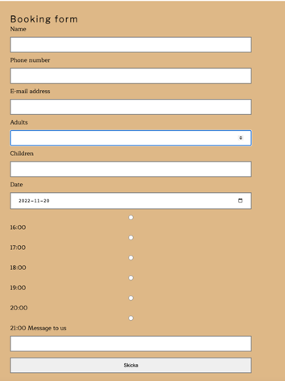
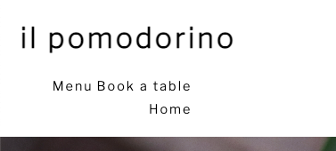
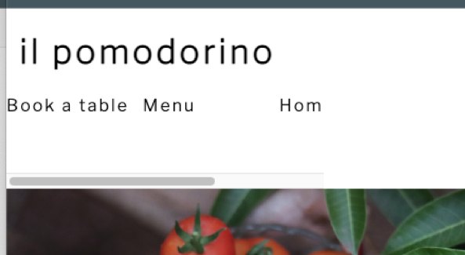

# Chef's Table: il pomodorino - rustic trattoria in Edinburgh #

## 1. Purpose of the project ##
il pomodorino is an Italian restaurant run by chefs Massimo Bottura and Fabio Vivani. The website is part of the restaurant´s digital marketing strategy, targeting local foodies and tourists in the Edinburgh area who are looking for a genuine experience of rustic Italian cuisine. The website helps visitors get familiar with the philosophy behind the food of the restaurant by introducing them to the chefs on the Home page. The two other pages show the menu, and a booking form through which visitors can book a table at the restaurant.

## 2. User stories ##

__Home page__
- As a visiting user, I want to read about the type of cuisine the restaurant offers so that I can see if it interests me.

__Menu Page__
- As a visiting user, I want to read the menu to see if I might be interested in eating the restaurant´s food.

__Booking Page__
- As a visiting user, I want to book a table for visiting the restaurant.

## 3. Features ##

__Header with Navigation Bar__

-	The header contains the restaurant logo and a navigation menu linking to each page on the website: Home, Menu and Book a table. The restaurant logo also has a link to the Home page.
-	The header bar is identical on all pages for good UX, however for small screens (mobile) the navbar aligns underneath the logo while maintaining the same styling and functionality.
-	The navbar ensures that the user can navigate and utilize the different pages of the website comfortably, as well as making it possible to keep e.g. the menu and booking pages in separate tabs. In doing this, the user doesn’t have to use the “back” button in case it wants to have another look at the menu or home page while in the middle of a booking.
-	The header and navbar are fully responsive to enable the user to navigate and explore the website comfortably without having to use the scrollbar. They are present on all pages.

 __The hero image__

 -	The hero image stretching the width of the screen is present on all pages. The image gives the visitor an impression of the food served, connects to the restaurant name (pomodorino is small tomato in Italian) as well as gives the visitor a place to rest their eyes from reading text.
-	On all pages, the page main content is below the hero image, except for the confirmation.html page (redirected to when submitting the booking form). On this page, there is a text overlay on the hero image, containing the confirmation message. On smaller screen sizes however, the confirmation message shows below the hero image.

__Our story Section__

 -	This section gives visitors who are interested in the cuisinge some background information to read, as well as an embedded YouTube video to watch about Southern Italy
 -	The visitor´s interest will be peaked at this point, inviting it to find out more about the food.

__Our chefs section__

 - 	This section provides short profiles on the two chefs, as well as an embedded YouTube video (an profile interview conducted by BBC about one of the chefs).
 - The video provides a break from reading and will increase interest in the chefs behind the restaurant. 

__The Footer__ 

- 	The footer is divided into three columns for easy navigation, and provides the user with contact details to the restaurant in the form of phone number, e-mail address and a physical address. 
- 	The second column contains opening hours to the restaurant.
- 	The third section contains social media icons with respective links to facebook and instagram, as well as a prompt to the user to follow the restaurant. Each link opens to a new tab for smoothness (so the user isn't directed away from the website)
 - 	The footer provides the user with all the information it needs to interact with the restaurant, either physically by calling, e-mailing or visiting, or digitally, by browsing their social media content and getting an image of how a visit will look like. 
  - The footer is present on all pages for easy access to this information.

__The Menu Page__

  - The menu opens in a new page and provides the visitor with a real-time screenshot of what options ara available at the restaurant. There is a menu for food followed by a drinks menu. The food menu has a section each for courses, and the drinks menu is divided has two sections. All sectinos in the menus are indicated by a line break.
  - The visitor will get a clear idea about the food and drinks on offer, and be able to decide if they might like the food, which will aid them in making a decision about visiting the restaurant or not.
  - The menu also shows the prices of the menu items, which is useful for the user as they will be able to make a decision about whether or not the restaurant is within price-range. The user can also put together a hypothetical meal in their mind and calculate how much a visit to the restaurant might cost. This also contributes to the decision making process.

__The Booking Page__

  - The booking page contains a booking form as its main content. The booking form allows the visitor to book a table at the restaurant by entering and submitting the following information: 
    - name, e-mail address and phone number (required),
    - desired date and time of the booking (required),
    - number of adults and children attending (required), 
    - an optional message to the restaurant (e.g. to specify if the booking is for a birthday celebration).
  - Placeholders were put in place for easier use of the form.

 

  __The Confirmation Page__
  - Once the visitor fills in the required information and submits the form, they are redirected to the confirmation page. This page has the same format and styling as the other pages, with a confirmation message appearing on the hero image (for larger screen sizes). For smaller screen sizes, the message appears below the hero image.
  - The confirmation message ensures the visitor that the booking form has been successfully submitted, so they can exit the page or continue exploring the other pages if they wish.

  

## 4. Future features ##

- In the further development of this website, an idea for a feature would be to keep the hero image static on the page wile allowing the page´s main elements to scroll up on top of it. This could make the website feel more interactive. Furthermore, a gallery with pictures and an awards section for the chefs could also be incorporated.

## 5. Typography and color scheme ##
All titles and larger text elements (including the logo, navbar, confirmation message, booking form titles and the titles on the Home page texts) were h1-h3 elements, and had the following typography:
- font-family: "Libre Franklin", sans-serif;
- letter-spacing: 3px;

The rest of the body elements including the paragraphs on the home page and the menu, as well as the footer, used the following typography:
- font-family: Maitree, sans-serif;

All text elements were black.
The overall color scheme is very light: predominantly white and black. Additionally there is light beige and grey touches of color in the booking page and as background to the confirmation message.

## 6. Wireframes ##
The software Balsamiq was used to create a rough visual for the three main pages of the website, before coding commenced. This helped visualize the end product and created a realistic scope for the project. Below are two of the mockups.

## 7. Technology ##
- The wireframing software tool Balsamiq was used to create a visual mockup early on in the project.
- GitPod was used to write and edit the code, while GitHub was used for deployment and to store a backup copy of the code.
- The code was written in HTML, and CSS was used for styling the elements.
- Google Fonts was used to import the fonts used on the website.
- FontAwesome was used for importing icons used in the footer.
- W3C validator was used for finding errors in the code throughout the project and improving quality.
- Chrome Dev tools was used for increasing responsivity, testing CSS rules and exploring ways of managing bugs in the code.
- Website [https://tinyjpg.com/] was used to compress the hero image without losing image quality.
- PageSpeed Insights of web.dev (part of Chrome Dev tools) was used to measure site performance, accessibility, SEO and best practice.

## 8. Testing ##
Test planning, test , test execution
Input (click to book a page) and expected output (user should be redirectedt o booking page.
(see recorded sound)

### 8.1 Code validation ###
mention the W3c validation I’ve done for my html and css code.
- HTML
  - No errors were returned when passing through the official [W3C validator](https://validator.w3.org/nu/?doc=https%3A%2F%2Fcode-institute-org.github.io%2Flove-running-2.0%2Findex.html)
- CSS
  - No errors were found when passing through the official [(Jigsaw) validator](https://jigsaw.w3.org/css-validator/validator?uri=https%3A%2F%2Fvalidator.w3.org%2Fnu%2F%3Fdoc%3Dhttps%253A%252F%252Fcode-institute-org.github.io%252Flove-running-2.0%252Findex.html&profile=css3svg&usermedium=all&warning=1&vextwarning=&lang=en#css)

### 8.2 Test cases ###
(user story based with screenshots) : usually done by test engineers, 
Try to have one user story per page, and put in screenshots

### 8.3 Fixed bugs ###

#### Bug 1 ####
When creating the booking form, all the form input items were bunched together instead of each displaying on a separate line. After trying various methods, I found that styling the actual input boxes with the following line of code made the error go away.

**input {**
**width: 100%;**
**padding: 12px 20px;**
**margin: 8px 0;**
**box-sizing: border-box;**
**border: 2px solid grey}**

The result was as follows:

This created two additional issues: the "Message to us" section was not aligned underneath the radio buttons, and the radio buttons were too far separated from their text.
Adding line breaks fixed the message box issue, and the radio buttons needed the following styling to align properly:

**.radio-button {vertical-align: baseline;**
**width: auto;**
**margin: 1%;}**

#### Bug 2 #### 
When creating a media query for mobile size screens, the navbar was supposed to align below the logo. Despite using:

**.navbar {float: left; clear: left; margin-left: 0%; padding: 0%; margin-bottom: 2%; line-height: 20px;}**

.**class, .navbar {display: inline-block;}**,

the header looked like this:

 

 I then tried 
 **nav {white-space: nowrap;}** and 
 **.navbar li {display: inline-block;}**
 to keep the navbar items in one line. That didn't work either. 
 
 Following this, I used the **overflow:hidden;** attribute in the parent and child list elements. This succeeded in aligning the navbar elements on one line, however the elements were in the wrong order and the page too wide:

 

Finally, using CSS flexbox, I applied the following code.
1. Set the **float:right** property to **none** for the list elements.
2. In the CSS: 
**header {display: flex; flex-direction: column;}**
3. **.navbar {display: flex; flex-direction: row-reverse; justify-content: flex-end;}**

The **flex-direction** reordered the elements, and **justify-content** made sure the elements kept to the left-hand side.

### 8.4 Supported screens and browsers ###
The website is tested for wide screens, with two media queries. One specific to screens up to 1280px, as well as a mobile version with media queries supporting screens up to 450px. Usually a tablet size version might have been present, but the version for screens up tp 1280 px worked well on tablet sizes too, which was why an additional media query was omitted. Chrome Dev Tools simulator was used to test for screen sizes.

## 9. Deployment ##

### 9.1 Via GitPod ###
The GitHub repository was created using the Code Institute GitPod template:
https://github.com/Code-Institute-Org/gitpod-full-template
- Click the link to get to the template. Click “Use this template”.
- Enter a repository name and a description, make sure the repository is public and then click “Create repository from template”.
- Click the green GitPod button, wait a moment for the workspace to open.
- The workspace is ready to be used.

### 9.2 Via GitHub Pages ###
Github Pages was used to deploy the website. The following steps were used:
- In GitHub, navigate to the repository and find the Settings tab at the top menu.
- Click on Pages in the left hand Menu.
- In “Build and deployment”, go to Branch, select main, and save.
- Wait a moment and refresh the page to find a box with the live URL. The website is now deployed.

## 10. Credits ##

In this section you need to reference where you got your content, media and extra help from. It is common practice to use code from other repositories and tutorials, however, it is important to be very specific about these sources to avoid plagiarism. 

You can break the credits section up into Content and Media, depending on what you have included in your project. 

### Content 

- The text for "Our story" on the Home page was taken from: https://michelecarbone.org/italian-cooking-essentials-and-philosophy/
- The text in the menu was taken from: https://wandervirtually.com/lunch-dinner-navigating-the-italian-restaurant-menu/
- The wine list on the Menu page was taken from: https://www.italianorchard.com/?page_id=273
- The CSS code shown below in bold, used for styling the input boxes and message box in the booking form, was taken from: https://coursera.w3schools.com/css/tryit.asp?filename=trycss_form_padding
**width: 100%;
padding: 12px 20px;
margin: 8px 0;
box-sizing: border-box;**

### Media

- The hero image was taken by (open source) Arjuun Sreekumar on [Pexels]: https://www.pexels.com/sv-se/foto/mat-halsosam-rod-tradgard-2006333/
- The icons in the footer were taken from [Font Awesome](https://fontawesome.com/)

In this section, you need to convince the assessor that you have conducted enough testing to legitimately believe that the site works well. Essentially, in this part you will want to go over all of your project’s features and ensure that they all work as intended, with the project providing an easy and straightforward way for the users to achieve their goals.

In addition, you should mention in this section how your project looks and works on different browsers and screen sizes.

You should also mention in this section any interesting bugs or problems you discovered during your testing, even if you haven't addressed them yet.

If this section grows too long, you may want to split it off into a separate file and link to it from here.